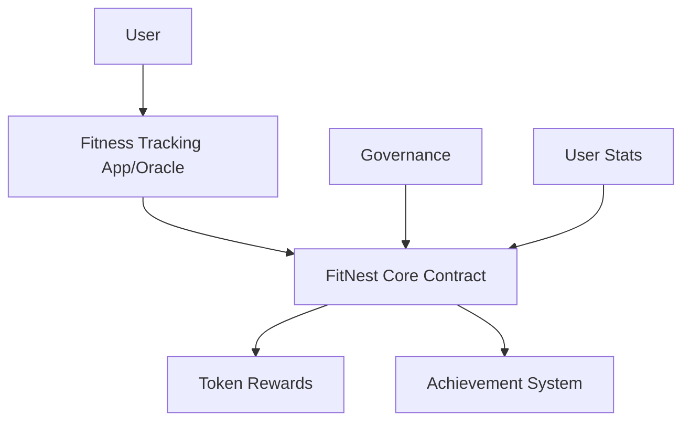

# FitNest Workout Rewards

A blockchain-based workout rewards system built on Stacks that incentivizes consistent home workout routines through verifiable tracking and token rewards.

## Overview

FitNest creates a gamified fitness experience by:
- Tracking and verifying workout completion through trusted oracles
- Rewarding users with tokens based on workout intensity and consistency
- Implementing achievement milestones to encourage long-term engagement
- Providing governance mechanisms for community-driven platform evolution

## Architecture

The system consists of multiple interacting components:



Core components:
- **Workout Verification**: Trusted oracles verify completed workouts
- **Reward System**: Dynamic token rewards based on workout type, duration, and streaks
- **Achievement System**: Milestones for consistency and variety
- **Governance**: Community-driven protocol upgrades and parameter adjustments
- **User Stats**: Comprehensive tracking of workout history and achievements

## Contract Documentation

### FitNest Core Contract

The main contract managing workout verification, rewards, and user achievements.

**Key Features:**
- Workout verification through authorized oracles
- Dynamic reward calculation system
- Achievement tracking and milestone rewards
- Governance proposal and voting system
- User statistics and streak tracking

**Access Control:**
- Contract Owner: Can manage oracles and transfer ownership
- Authorized Oracles: Can verify workouts
- Users: Can participate in workouts and governance
- Anyone: Can view public stats and achievements

## Getting Started

### Prerequisites
- Clarinet CLI
- Stacks wallet
- Integration with supported fitness tracking apps

### Basic Usage

1. **Verify a Workout:**
```clarity
(contract-call? 
  .fitnest-core verify-workout 
  user-principal 
  workout-id 
  WORKOUT-TYPE-CARDIO 
  u30)
```

2. **Check User Stats:**
```clarity
(contract-call? 
  .fitnest-core get-user-stats 
  user-principal)
```

3. **View Achievements:**
```clarity
(contract-call? 
  .fitnest-core get-all-user-achievements 
  user-principal)
```

## Function Reference

### Core Functions

**Workout Verification**
```clarity
(verify-workout 
  (user principal) 
  (workout-id (buff 32)) 
  (workout-type uint)
  (duration-minutes uint))
```

**User Stats**
```clarity
(get-user-stats (user principal))
```

**Achievement Check**
```clarity
(get-user-achievement 
  (user principal) 
  (achievement-id uint))
```

### Governance Functions

**Create Proposal**
```clarity
(create-proposal 
  (proposal-type uint) 
  (description (string-utf8 256)) 
  (metadata (buff 256)))
```

**Vote on Proposal**
```clarity
(vote-on-proposal 
  (proposal-id uint) 
  (vote-for bool))
```

## Development

### Testing
1. Clone the repository
2. Install dependencies: `clarinet install`
3. Run tests: `clarinet test`

### Local Development
1. Start local chain: `clarinet chain`
2. Deploy contracts: `clarinet deploy`
3. Interact using the console: `clarinet console`

## Security Considerations

### Limitations
- Oracle trust requirements
- Maximum 3 workouts per day
- Minimum workout duration of 5 minutes
- Maximum workout duration of 180 minutes

### Best Practices
- Verify oracle authenticity before use
- Monitor reward calculations for economic balance
- Follow governance voting periods
- Be aware of daily workout limits
- Consider achievement requirements when planning workouts